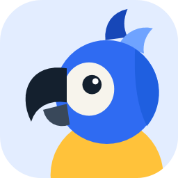
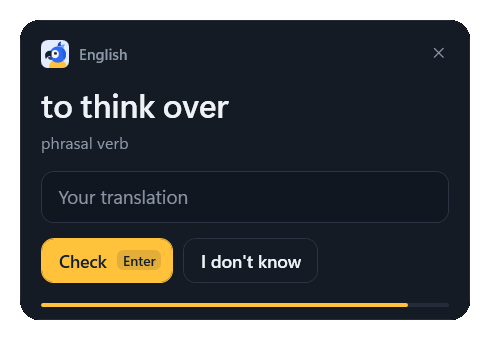
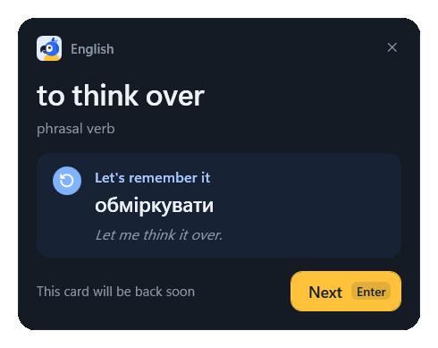
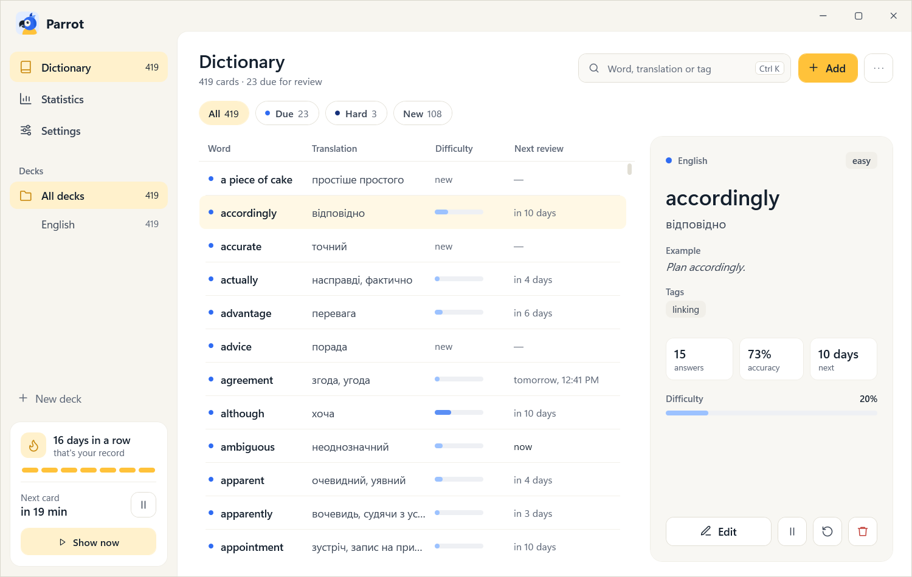
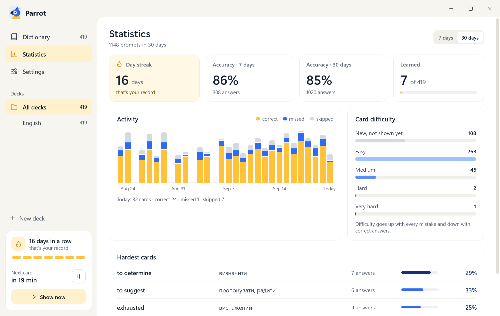
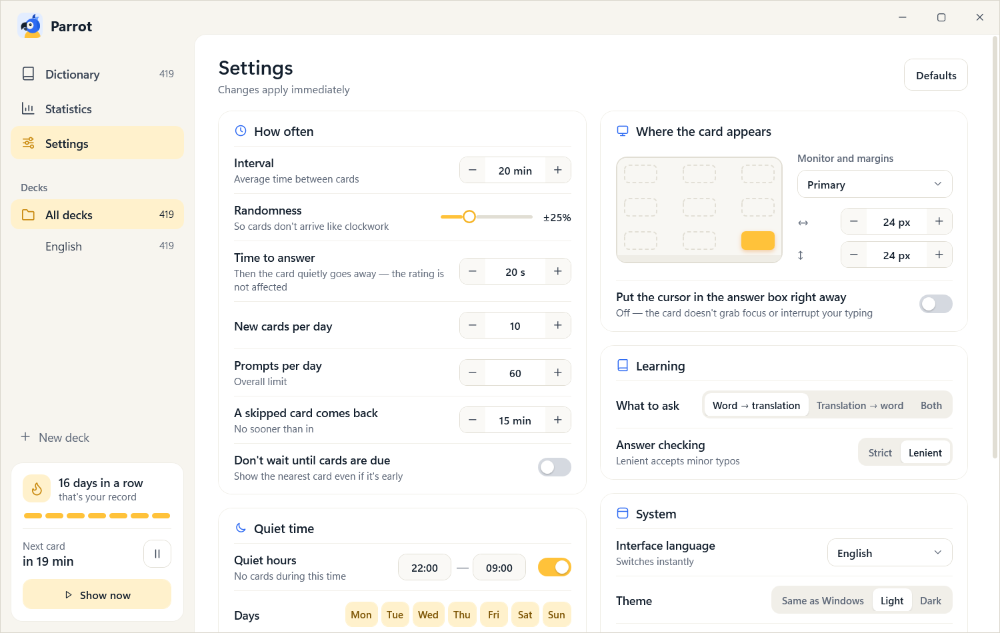

<div align="center">



# Parrot

**Learn vocabulary in the background, a few seconds at a time.**

A Windows tray app that now and then slides in a small card with a word or phrase and a box
for its translation — without stealing focus, and without punishing you for ignoring it.

[](https://github.com/vitaliykisil65/Parrot/releases/latest)
[](https://github.com/vitaliykisil65/Parrot/releases)


[](LICENSE)

[**Download for Windows**](https://github.com/vitaliykisil65/Parrot/releases/latest) ·
[Features](#features) · [Screenshots](#screenshots) · [Building](#building-from-source)

<br>


&nbsp;


</div>

## Why Parrot

Flashcard apps work — when you remember to open them. Parrot flips that around: the cards come
to you while you work, one at a time, in a corner of the screen. Answer in five seconds and get
back to what you were doing, or simply ignore the card and it will fade away on its own.

## Features

- 🪟 **Never steals focus.** The card appears at the edge of the screen and doesn't interrupt
  your typing. Click it when you're ready — or don't.
- 🙈 **Ignoring is free.** A card you let time out doesn't hurt its rating; it just comes back later.
- 🧠 **Spaced repetition.** Every card has its own difficulty: the worse you know a word, the more
  often you see it. New cards are introduced at a pace you choose.
- ✍️ **Forgiving answer checking.** Small typos are accepted (and the correct spelling is shown),
  several correct translations can be listed per card, and synonyms from other cards count too.
- 🤷 **"I don't know"** reveals the answer with an example right away.
- 🔕 **Knows when to stay quiet.** Quiet hours, active days, a daily limit, a pause from the tray,
  and no cards while a full-screen app or presentation is running or you're away from the keyboard.
- 🎮 **Practice games** when you want more than a card at a time: flashcards, multiple choice,
  writing, a *learn* mode that walks every card from choice to writing, a timed *match* board and
  a one-minute *true or false*. Pick the whole dictionary, a deck, a random handful, the hardest
  cards, the new ones or last week's mistakes, switch the direction on the fly, and keep going
  until the whole set is learned. Mistakes made in a game make the card come back sooner as a
  prompt; practice never eats into the daily prompt limits.
- 🔤 **Transcriptions** — an optional pronunciation for every word, with a bar of IPA symbols to
  type it, shown on the prompt, in the dictionary and in the games.
- 📚 **Dictionary** with decks, search, filters (due, hard, new, suspended), an optional type for
  each card (word, phrase, phrasal verb, idiom), a recycle bin with undo, and CSV import/export.
- 📊 **Statistics:** day streak, accuracy, a 30-day activity chart, difficulty distribution and
  your hardest cards.
- 🎨 **Light and dark themes** that follow Windows, a custom window frame and a quiet chime.
- 🌍 **English and Ukrainian UI**, switchable on the fly; follows the Windows language by default.
- 🔄 **Updates itself** from GitHub releases — verified by size and SHA-256 before installing.
- 🚀 **Starts with Windows** straight to the tray. No admin rights, no runtime to install.

## Screenshots

<table>
  <tr>
    <td width="50%">
      <picture>
        <source media="(prefers-color-scheme: dark)" srcset="docs/screenshots/dictionary-dark.png">
        
      </picture>
      <p align="center"><b>Dictionary</b> — decks, search, filters and per-card progress</p>
    </td>
    <td width="50%">
      <picture>
        <source media="(prefers-color-scheme: dark)" srcset="docs/screenshots/statistics-dark.png">
        
      </picture>
      <p align="center"><b>Statistics</b> — streak, accuracy and a month of activity</p>
    </td>
  </tr>
  <tr>
    <td width="50%">
      <picture>
        <source media="(prefers-color-scheme: dark)" srcset="docs/screenshots/settings-dark.png">
        
      </picture>
      <p align="center"><b>Settings</b> — applied instantly, no Save button</p>
    </td>
    <td width="50%">
      
      <p align="center"><b>Localized</b> — the same app in Ukrainian</p>
    </td>
  </tr>
</table>

<sub>Screenshots follow your GitHub theme: switch between light and dark to see both.</sub>

## Installation

1. Download `Parrot-Setup-<version>.exe` from the [latest release](https://github.com/vitaliykisil65/Parrot/releases/latest).
2. Run it. Parrot installs per user into `%LocalAppData%\Programs\Parrot` — no admin rights needed.

The installer adds a Start menu shortcut (a desktop one is optional), an optional
"Start with Windows" checkbox, and an entry in **Settings → Apps**. Uninstalling removes the
autostart entry and asks whether to delete your dictionary and settings (`%AppData%\Parrot`);
by default they are kept.

> [!NOTE]
> The installer isn't code-signed yet, so on first launch SmartScreen shows "Unknown publisher".
> Click **More info → Run anyway**.

### Updates

An installed Parrot checks the latest GitHub release 30 seconds after start and every 6 hours
after that. When there's a newer version, a **New version X** card appears at the bottom of the
sidebar, plus an item in the tray menu. **Update** downloads the installer, verifies its size and
SHA-256, installs it silently and restarts Parrot. The ✕ skips that version until the next one
comes out. **Settings → System** has **Check for updates** and a toggle for automatic checks.

Portable or dev builds can't update in place — there the button opens the release page.

## Getting started

- The first launch creates an empty **English** deck. Click **Add** (`Ctrl+N`) to add cards, or
  import a CSV file from the **⋯** menu.
- CSV columns are `Front, Back, Hint, Example, Tags, Transcription, Kind`; only the first two
  are required, and a header row is optional. With a header the columns may come in any order.
  Separate several correct translations with semicolons: `big; large`. `Kind` is `word`,
  `phrase`, `phrasal verb` or `idiom`.
- **Practice** (`Ctrl+2`) is for a focused session: choose a game and a set of cards and press
  `Enter`. Every game is playable from the keyboard — `Space` flips a card, `←`/`→` answer,
  `1`–`4` pick an option, `Esc` ends the session.
- Don't want to wait for the first card? **Show now** in the sidebar or the tray menu.

## Building from source

Requirements: Windows 10/11 and the [.NET 10 SDK](https://dotnet.microsoft.com/download).

```bash
dotnet run --project src/Parrot.App
```

```bash
dotnet test
```

- Data lives in `%AppData%\Parrot\parrot.db` (SQLite). Debug builds seed the first deck with a
  419-word starter list from `src/Parrot.App/DevData/StarterDeck.csv`; Release builds and the
  installer start empty. `-p:IncludeStarterDeck=true` embeds the list into any build.
- `--tray` starts without opening the main window — that's how Parrot launches with Windows.
- `PARROT_DATA_DIR` points the app at another data folder, so you can play with a demo database
  without touching your real one. Such a copy runs next to the everyday one.
- `PARROT_UPDATE_URL` replaces the "latest release" URL (for example with a local JSON file),
  so updates can be tested without GitHub.
- Logs are written to `%AppData%\Parrot\logs`.

### Building the installer

Requires [Inno Setup](https://jrsoftware.org/isinfo.php): `winget install JRSoftware.InnoSetup`.

```bash
pwsh scripts/build-installer.ps1
```

The script runs the tests, publishes a self-contained single-file `artifacts/publish/Parrot.exe`
and builds `artifacts/installer/Parrot-Setup-<version>.exe`. The version comes from `<Version>`
in `src/Parrot.App/Parrot.App.csproj`.

### Publishing a release

Requires the GitHub CLI (`winget install GitHub.cli`, then `gh auth login`) and
`<UpdateRepository>owner/repo</UpdateRepository>` in `Parrot.App.csproj` — installed copies take
their updates from that repository, so its releases must be public.

1. Bump `<Version>` in `Parrot.App.csproj` and commit.
2. Run `pwsh scripts/publish-release.ps1 -Notes "What changed"`.

The script builds the installer, tags `v<version>`, pushes, and creates a release with
`Parrot-Setup-<version>.exe` attached. Installed copies offer it within 6 hours.

## Project layout

```
src/Parrot.Core          domain, spaced repetition, answer checking, SQLite, logo (net10.0)
src/Parrot.App           WPF: tray, prompt window, main window (dictionary, statistics, settings)
tests/Parrot.Core.Tests  xUnit tests for the core
tools/Parrot.IconGen     generates assets/parrot.ico from the vector logo
installer/Parrot.iss     installer script (Inno Setup)
scripts/                 installer build and release publishing
docs/screenshots/        images used in this README
```

Stack: .NET 10 · WPF · SQLite · no third-party UI libraries.

### Localization

All UI text lives in `src/Parrot.App/Localization/Strings.resx` (English, the neutral language
and the fallback for missing keys); `Strings.uk.resx` is the Ukrainian translation. To add a
language:

1. Copy `Strings.resx` to `Strings.<code>.resx` (e.g. `Strings.de.resx`) and translate the values.
2. Add the language to `L.Known` in `src/Parrot.App/Localization/L.cs` (and plural rules to
   `L.PluralForm` if it needs more than English's two forms).

It then shows up in **Settings → System → Interface language** and switches without a restart.
Plural forms are separated with `|`: `card|cards`, `картка|картки|карток`. The installer's
own strings are in `installer/Parrot.iss` under `[CustomMessages]`.

### Logo

The logo — a blue macaw — is described as a set of path geometries in
`src/Parrot.Core/Branding/ParrotLogo.cs`, so a single source drives the UI, the app icon and the
tray icon (which switches to an outlined version on a dark taskbar). Regenerate the icon after
editing it:

```bash
dotnet run --project tools/Parrot.IconGen
```

## License

[MIT](LICENSE) © Vitalii Kysil
